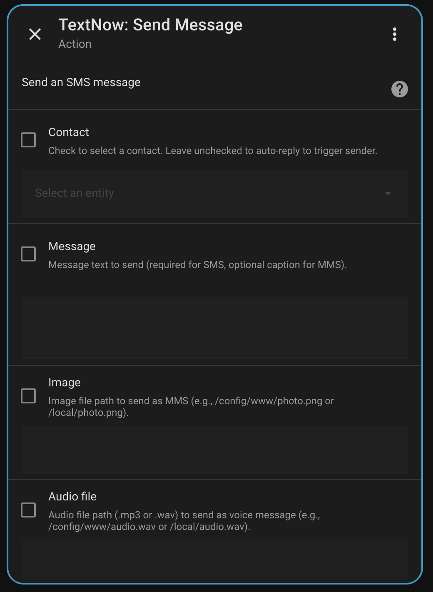
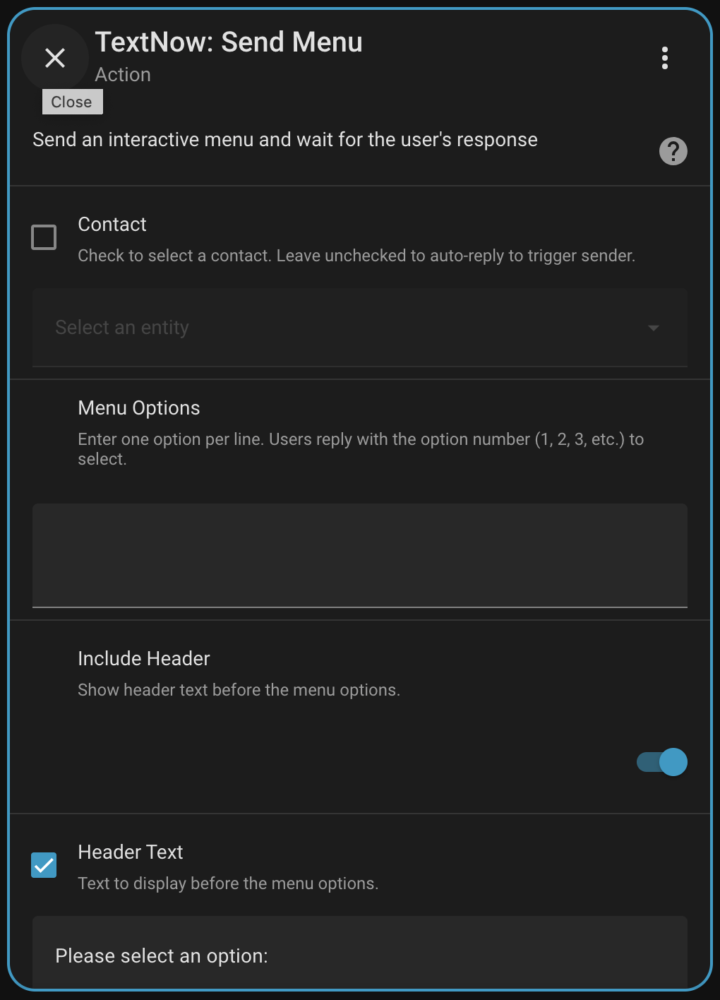
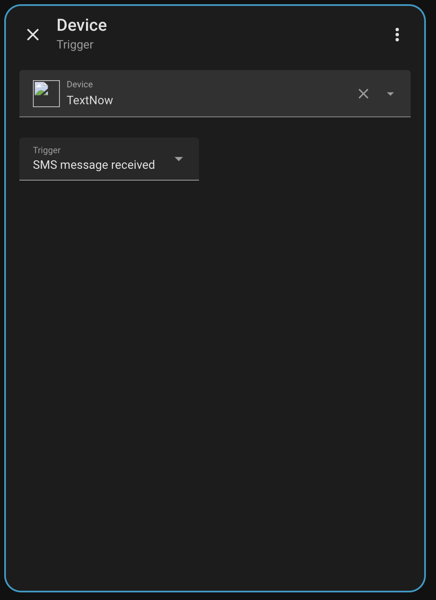
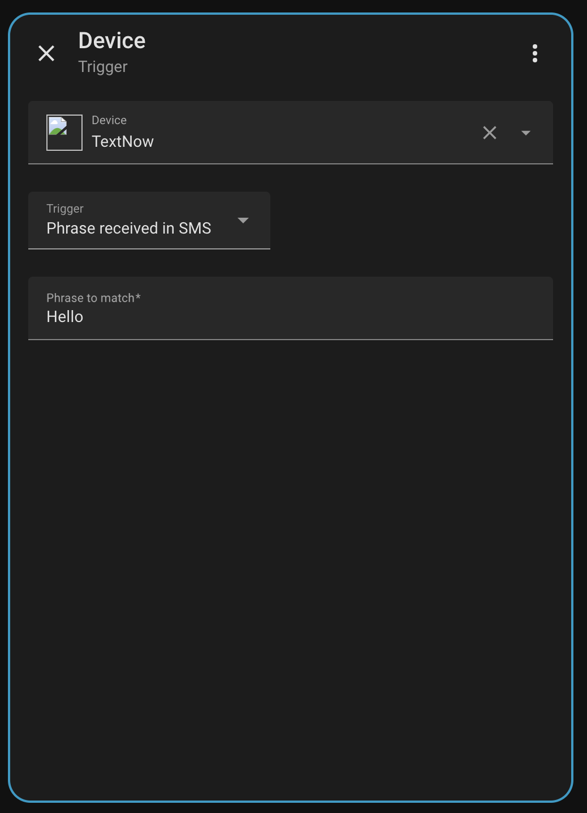

# TextNow Home Assistant Integration

<div align="center">


**Send and receive SMS/MMS messages through TextNow. Create interactive SMS menus for smart home control.**

[](https://github.com/zodyking/Home-Assistant-TextNow/releases)
[](LICENSE)
[](https://hacs.xyz)

</div>

---

## Table of Contents

- [Features](#features)
- [Installation](#installation)
- [Initial Configuration](#initial-configuration)
- [Managing Contacts](#managing-contacts)
- [Services](#services)
  - [textnow.send](#textnowsend)
  - [textnow.send_menu](#textnowsend_menu)
- [Triggers](#triggers)
  - [SMS Message Received](#sms-message-received)
  - [Phrase Received in SMS](#phrase-received-in-sms)
- [Automation Examples](#automation-examples)
- [Template Variables](#template-variables)
- [Troubleshooting](#troubleshooting)

---

## Features

| Feature | Description |
|---------|-------------|
| **Send SMS** | Send text messages to any contact |
| **Send MMS** | Send images with optional captions |
| **Send Voice Messages** | Send audio files as voice messages |
| **Interactive Menus** | Send numbered menus, wait for response, take action |
| **Message Triggers** | Trigger automations when any contact texts you |
| **Phrase Triggers** | Trigger automations when a specific phrase is received |
| **Auto-Reply** | Automatically reply to whoever triggered the automation |
| **Contact Sensors** | Track message history per contact |

---

## Installation

### HACS Installation (Recommended)

1. Open **HACS** → **Integrations**
2. Click **⋮** menu → **Custom repositories**
3. Enter URL: `https://github.com/zodyking/Home-Assistant-TextNow`
4. Select Category: **Integration**
5. Click **Add**
6. Find "TextNow" → Click **Download**
7. **Restart Home Assistant**

### Manual Installation

1. Download the `custom_components/textnow` folder
2. Copy to `config/custom_components/`
3. Restart Home Assistant

---

## Initial Configuration

### Step 1: Get Your TextNow Username

1. Go to [textnow.com](https://www.textnow.com) and sign in
2. Click **Settings** (gear icon)
3. Your username is displayed on the settings page
   - ⚠️ Use your **username**, NOT your email address

### Step 2: Get Your Browser Cookies

1. While logged into TextNow, press **F12** (Developer Tools)
2. Click the **Network** tab
3. Refresh the page (F5)
4. Click any network request
5. Find the **Cookie** header in Request Headers
6. Copy the entire cookie string

**Required cookies:** `connect.sid`, `_csrf`, `XSRF-TOKEN`

### Step 3: Add the Integration

1. Go to **Settings** → **Devices & Services**
2. Click **+ Add Integration**
3. Search for **TextNow**
4. Enter username and paste cookie string
5. Click **Submit**

---

## Managing Contacts

### Adding a Contact

1. Go to **Settings** → **Devices & Services** → **TextNow**
2. Click **Configure**
3. Select **Add Contact**
4. Enter:
   - **Name**: Contact's name (e.g., "John")
   - **Phone**: 10-digit phone number (e.g., "5551234567")
5. Click **Submit**

Each contact creates a sensor: `sensor.textnow_<name>`

---

## Services

### textnow.send

Send an SMS, MMS, or voice message to a contact.



#### Fields

| Field | Required | Description |
|-------|----------|-------------|
| **Contact** | No | Check to select a contact. **Leave unchecked to auto-reply to trigger sender.** |
| **Message** | No* | Text message content |
| **Image** | No* | File path for MMS image |
| **Audio file** | No* | File path for voice message |

*At least one of Message, Image, or Audio file is required.

#### Auto-Reply Feature

When the **Contact checkbox is unchecked**, the service automatically replies to whoever triggered the automation. This works seamlessly with the TextNow triggers.

#### Examples

**Send to specific contact (checkbox checked):**
```yaml
service: textnow.send
data:
  contact_id: sensor.textnow_john
  message: "Hello from Home Assistant!"
```

**Auto-reply to trigger sender (checkbox unchecked):**
```yaml
# No contact_id needed - replies to whoever sent the triggering message
service: textnow.send
data:
  message: "Got your message!"
```

**Send MMS with image:**
```yaml
service: textnow.send
data:
  contact_id: sensor.textnow_john
  message: "Check out this photo!"
  mms_image: /config/www/images/photo.jpg
```

**Send voice message:**
```yaml
service: textnow.send
data:
  contact_id: sensor.textnow_john
  voice_audio: /config/www/audio/message.mp3
```

---

### textnow.send_menu

Send an interactive numbered menu and wait for the user's response.



#### Fields

| Field | Required | Default | Description |
|-------|----------|---------|-------------|
| **Contact** | No | - | Check to select contact. Unchecked = auto-reply to trigger sender |
| **Menu Options** | Yes | - | One option per line |
| **Include Header** | No | On | Show header before options |
| **Header Text** | No | "Please select an option:" | Header text |
| **Include Footer** | No | On | Show footer after options |
| **Footer Text** | No | "Reply with the number of your choice" | Footer text |
| **Timeout** | No | 30 | Seconds to wait for response |
| **Number Format** | No | "{n}. {option}" | Format for each option |

#### How It Works

1. Service sends the menu as SMS
2. Service **waits** for user to reply
3. User replies with a number (1, 2, 3...)
4. Service returns the response
5. Your automation continues based on their choice

#### Menu Message Example

```
Please select an option:

1. Turn on lights
2. Turn off lights
3. Lock all doors

Reply with the number of your choice
```

#### Response Variable

Use `response_variable` to capture the response:

```yaml
service: textnow.send_menu
data:
  options: |
    Turn on lights
    Turn off lights
response_variable: user_choice
```

The response contains:

| Field | Description |
|-------|-------------|
| `option` | Selected number (1, 2, 3...) |
| `option_index` | Zero-based index (0, 1, 2...) |
| `value` | Text of selected option |
| `raw_text` | What user typed |
| `timed_out` | True if no response before timeout |

#### Examples

**Basic menu with auto-reply:**
```yaml
service: textnow.send_menu
data:
  options: |
    Turn on lights
    Turn off lights
    Check status
  timeout: 60
response_variable: choice
```

**Custom header and footer:**
```yaml
service: textnow.send_menu
data:
  contact_id: sensor.textnow_john
  header: "🏠 Smart Home Control"
  options: |
    Living room ON
    Living room OFF
    All lights OFF
  footer: "Reply 1-3"
response_variable: choice
```

---

## Triggers

TextNow provides two device triggers for automations.

### SMS Message Received

Fires when **any contact** sends you a message.



#### Setup

1. Create new automation
2. **Add Trigger** → **Device**
3. Select **TextNow** device
4. Choose **SMS message received**

#### Available Variables

| Variable | Description |
|----------|-------------|
| `{{ trigger.contact_name }}` | Sender's name |
| `{{ trigger.contact_id }}` | Contact ID (for replies) |
| `{{ trigger.message }}` | Message text |
| `{{ trigger.phone }}` | Phone number |

#### YAML Example

```yaml
automation:
  - alias: "Log incoming SMS"
    trigger:
      - platform: device
        domain: textnow
        device_id: <your_device_id>
        type: message_received
    action:
      - service: logbook.log
        data:
          name: "SMS"
          message: "{{ trigger.contact_name }}: {{ trigger.message }}"
```

---

### Phrase Received in SMS

Fires when a message contains a **specific phrase**.



#### Setup

1. Create new automation
2. **Add Trigger** → **Device**
3. Select **TextNow** device
4. Choose **Phrase received in SMS**
5. Enter the **Phrase to match**

#### Matching Rules

- **Case-insensitive**: "LIGHTS" matches "lights"
- **Anywhere in message**: "turn on the lights please" matches phrase "lights"

#### Additional Variable

| Variable | Description |
|----------|-------------|
| `{{ trigger.matched_phrase }}` | The phrase that matched |

#### YAML Example

```yaml
automation:
  - alias: "Lights on via SMS"
    trigger:
      - platform: device
        domain: textnow
        device_id: <your_device_id>
        type: phrase_received
        phrase: "lights on"
    action:
      - service: light.turn_on
        target:
          entity_id: light.living_room
      - service: textnow.send
        data:
          message: "Lights turned on! 💡"
```

---

## Automation Examples

### Interactive Menu Control

When anyone texts "menu", send them a control menu:

```yaml
automation:
  - alias: "SMS Menu Control"
    trigger:
      - platform: device
        domain: textnow
        device_id: <your_device_id>
        type: phrase_received
        phrase: "menu"
    action:
      - service: textnow.send_menu
        data:
          header: "🏠 Home Control"
          options: |
            Turn on lights
            Turn off lights
            Lock doors
          timeout: 60
        response_variable: choice
      
      - choose:
          - conditions: "{{ choice.option == 1 }}"
            sequence:
              - service: light.turn_on
                target:
                  entity_id: light.living_room
              - service: textnow.send
                data:
                  message: "✅ Lights ON"
          
          - conditions: "{{ choice.option == 2 }}"
            sequence:
              - service: light.turn_off
                target:
                  entity_id: light.living_room
              - service: textnow.send
                data:
                  message: "✅ Lights OFF"
          
          - conditions: "{{ choice.option == 3 }}"
            sequence:
              - service: lock.lock
                target:
                  entity_id: lock.front_door
              - service: textnow.send
                data:
                  message: "🔒 Doors locked"
          
          - conditions: "{{ choice.timed_out }}"
            sequence:
              - service: textnow.send
                data:
                  message: "⏰ Menu timed out"
```

### Home Status Report

```yaml
automation:
  - alias: "SMS Status"
    trigger:
      - platform: device
        domain: textnow
        device_id: <your_device_id>
        type: phrase_received
        phrase: "status"
    action:
      - service: textnow.send
        data:
          message: >
            🏠 HOME STATUS
            🌡️ Inside: {{ states('sensor.indoor_temp') }}°F
            💡 Lights on: {{ states.light | selectattr('state', 'eq', 'on') | list | count }}
            🔒 Door: {{ states('lock.front_door') }}
```

### Security Alert with Photo

```yaml
automation:
  - alias: "Motion Alert"
    trigger:
      - platform: state
        entity_id: binary_sensor.motion
        to: "on"
    action:
      - service: camera.snapshot
        target:
          entity_id: camera.front_door
        data:
          filename: /config/www/snapshot.jpg
      - delay: 2
      - service: textnow.send
        data:
          contact_id: sensor.textnow_john
          message: "🚨 Motion detected!"
          mms_image: /config/www/snapshot.jpg
```

---

## Template Variables

### Trigger Variables

| Variable | Example | Description |
|----------|---------|-------------|
| `{{ trigger.contact_name }}` | "John" | Sender's name |
| `{{ trigger.contact_id }}` | "contact_john" | Contact ID |
| `{{ trigger.message }}` | "Hello" | Message text |
| `{{ trigger.phone }}` | "+15551234567" | Phone number |
| `{{ trigger.matched_phrase }}` | "lights on" | Matched phrase (phrase trigger only) |

### Response Variables (send_menu)

| Variable | Example | Description |
|----------|---------|-------------|
| `{{ choice.option }}` | `1` | Selected option number |
| `{{ choice.option_index }}` | `0` | Zero-based index |
| `{{ choice.value }}` | "Turn on lights" | Option text |
| `{{ choice.raw_text }}` | "1" | User's reply |
| `{{ choice.timed_out }}` | `false` | True if timeout |

---

## Sensor Entities

Each contact creates a sensor: `sensor.textnow_<contact_name>`

### Attributes

| Attribute | Description |
|-----------|-------------|
| `phone` | Contact's phone number |
| `last_inbound` | Last received message |
| `last_inbound_ts` | Timestamp of last received |
| `last_outbound` | Last sent status |
| `last_outbound_ts` | Timestamp of last sent |

---

## Troubleshooting

### Triggers Not Firing

1. Ensure sender is a saved contact
2. Check phrase is in the message (case-insensitive)
3. Enable debug logging:

```yaml
logger:
  logs:
    custom_components.textnow: debug
```

### Menu Not Waiting

- Increase `timeout` value
- Verify `response_variable` is set

### Authentication Errors

- Cookies expire periodically
- Re-copy fresh cookies from browser

### Finding Device ID

1. Go to **Settings** → **Devices & Services** → **TextNow**
2. Click the TextNow device
3. Device ID is in the URL

---

## Requirements

- Home Assistant 2023.7.0+
- Valid TextNow account
- Active browser session cookies

---

## Support

- [GitHub Issues](https://github.com/zodyking/Home-Assistant-TextNow/issues)
- [GitHub Discussions](https://github.com/zodyking/Home-Assistant-TextNow/discussions)

---

Made with ❤️ for the Home Assistant community
